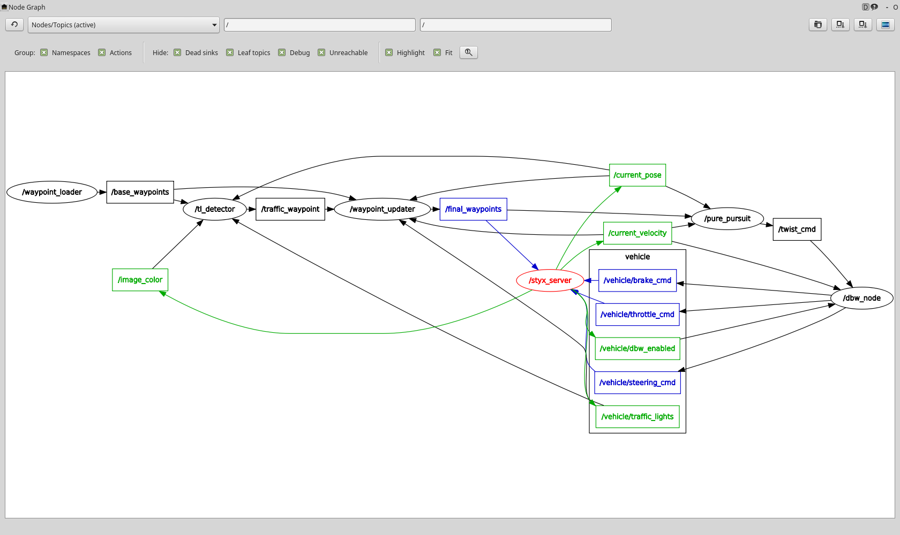
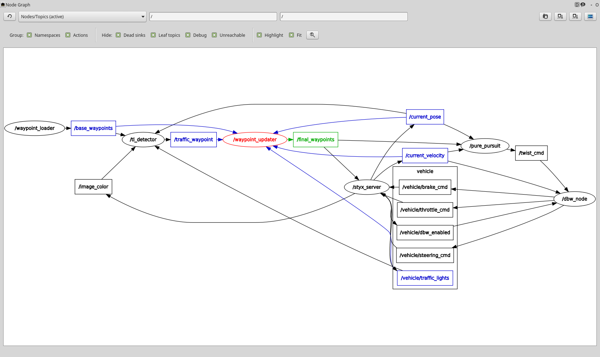
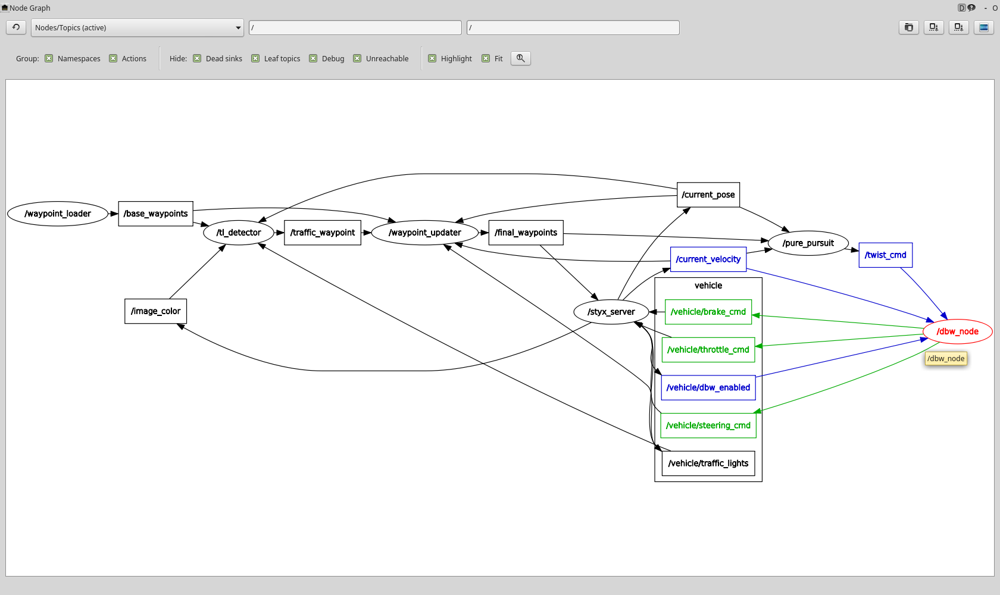

This is the project repo for the final project of the Udacity Self-Driving Car Nanodegree: Programming a Real Self-Driving Car. 

-----------------------------------------------------


### Late4Real Team   

Active memebers:

|   Name                |     Email                     |
| --------------------- |------------------             |
| Piermarco Pascale     | piermarco.pascale@gmail.com   |
| Thomas Wieczorek      | Weedjo@gmail.com              |
| Venkateswarlu Borra   | venkateswarluborra9@gmail.com |
| Andrei Feklistov      | feklistoff@yandex.ru          |
| Siva Ravella          | sbravell@mtu.edu              |


### ROS ARCHITECTURE

1. SIMULATOR RUNNING


This node was provided by Udacity. Our team apported little modifications to improve overall performance.

2. WAYPOINT UPDATER NODE


This node was built from scratch by our team. It uses informations from simulator and publishes a path of waypoints to follow.

3. TRAFFIC LIGHTS DETECTOR


This node was built using this [tutorial](https://github.com/alex-lechner/Traffic-Light-Classification) as a reference. We retrained the model and we are improving its performance.

4. DBW NODE


This node was built from scratch by our team. It converts the informations taken from twist_cmd node into brake, throttle and steering commands and publishes them.


### ACHIEVEMENTS

1. Our car can drive safely around a lap of the simulator, stopping for red traffic lights
2. Our car can detect and classify traffic lights using its camera
3. Our car drives according to top speed limits

### TODO

1. Improve TL detector performance
2. Rely only on traffic light detector without the help of simulator ground truth


### Native Installation

* Be sure that your workstation is running Ubuntu 16.04 Xenial Xerus or Ubuntu 14.04 Trusty Tahir. [Ubuntu downloads can be found here](https://www.ubuntu.com/download/desktop).
* If using a Virtual Machine to install Ubuntu, use the following configuration as minimum:
  * 2 CPU
  * 2 GB system memory
  * 25 GB of free hard drive space

  The Udacity provided virtual machine has ROS and Dataspeed DBW already installed, so you can skip the next two steps if you are using this.

* Follow these instructions to install ROS
  * [ROS Kinetic](http://wiki.ros.org/kinetic/Installation/Ubuntu) if you have Ubuntu 16.04.
  * [ROS Indigo](http://wiki.ros.org/indigo/Installation/Ubuntu) if you have Ubuntu 14.04.
* [Dataspeed DBW](https://bitbucket.org/DataspeedInc/dbw_mkz_ros)
  * Use this option to install the SDK on a workstation that already has ROS installed: [One Line SDK Install (binary)](https://bitbucket.org/DataspeedInc/dbw_mkz_ros/src/81e63fcc335d7b64139d7482017d6a97b405e250/ROS_SETUP.md?fileviewer=file-view-default)
* Download the [Udacity Simulator](https://github.com/udacity/CarND-Capstone/releases).

### Docker Installation
[Install Docker](https://docs.docker.com/engine/installation/)

Build the docker container
```bash
docker build . -t capstone
```

Run the docker file
```bash
docker run -p 4567:4567 -v $PWD:/capstone -v /tmp/log:/root/.ros/ --rm -it capstone
```

### Port Forwarding
To set up port forwarding, please refer to the [instructions from term 2](https://classroom.udacity.com/nanodegrees/nd013/parts/40f38239-66b6-46ec-ae68-03afd8a601c8/modules/0949fca6-b379-42af-a919-ee50aa304e6a/lessons/f758c44c-5e40-4e01-93b5-1a82aa4e044f/concepts/16cf4a78-4fc7-49e1-8621-3450ca938b77)

### Usage

1. Clone the project repository
```bash
git clone https://github.com/Paionir/System_Integration_SDC.git
```

2. Install python dependencies
```bash
cd CarND-Capstone
pip install -r requirements.txt
```
3. Make and run styx
```bash
cd ros
catkin_make
source devel/setup.sh
roslaunch launch/styx.launch
```
4. Run the simulator


A mention goes to Andre Marais for its intial contribution to the project before he left the team
